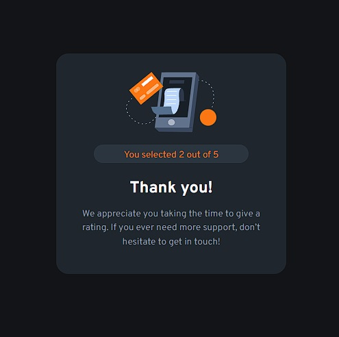
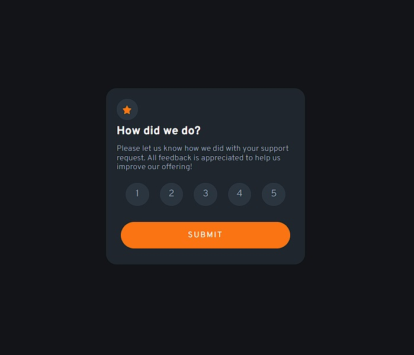

# Frontend Mentor - Interactive rating component solution

This is a solution to the [Interactive rating component challenge on Frontend Mentor](https://www.frontendmentor.io/challenges/interactive-rating-component-koxpeBUmI). Frontend Mentor challenges help you improve your coding skills by building realistic projects. 

## Table of contents

- [Overview](#overview)
  - [The challenge](#the-challenge)
  - [Screenshot](#screenshot)
  - [Links](#links)
- [My process](#my-process)
  - [Built with](#built-with)
  - [What I learned](#what-i-learned)
  - [Continued development](#continued-development)
  - [Useful resources](#useful-resources)
- [Author](#author)
- [Acknowledgments](#acknowledgments)

**Note: Delete this note and update the table of contents based on what sections you keep.**

## Overview

### The challenge

Users should be able to:

- View the optimal layout for the app depending on their device's screen size
- See hover states for all interactive elements on the page
- Select and submit a number rating
- See the "Thank you" card state after submitting a rating

### Screenshots

### Links

- Solution URL: (https://www.frontendmentor.io/solutions/interactive-rating-component-using-html5-css-sass-and-javascript-S9UDsjsWeJ)
- Live Site URL: (https://roonder-details.netlify.app/)

## My process

- This was a really nice experience on using the CSS and HTML Forms to build a nice rating component. I took me a while to figure out how to locate properly the buttons, and how to add nice styles on them. It can still be improved, but this was a really good approach, using an only page and swapping the sections using CSS and JavaScript.

### Built with

- Semantic HTML5 markup
- CSS custom properties
- Flexbox
- SASS (https://sass-lang.com/) - CSS Pre-processor
- Mobile-first workflow
- JavaScript ES6
- Gulp (https://gulpjs.com/) - Node.js Toolkit
- Node.js (https://nodejs.org/es/) - JavaScript Enviroment

### What I learned

I reinforced some basic knowledges in this project, improving on how to use better my CSS and interact properly with the DOM using JavaScript. I'm really proud on the DOM change using the display settings and the function that allows this change.

### Continued development

I plan to use this experience to keep improving my projects using JavaScript to add more functionality to my future projects. Besides of that, it's been a really nice way to keep improving my CSS knowledges, leading me to get better on it and use it with more freedom.

### Useful resources

- [Interactive Rating Component - Adan Saavedra](https://github.com/AdanSaavedra/Interactive-rating-component) - This repository helped me on understanding my idea on how to use the radio inputs and apply it using another approach.

## Author

- Website - [Roonder](https://github.com/Roonder)
- Frontend Mentor - [@roonder](https://www.frontendmentor.io/profile/Roonder)
- LinkedIn - [@roonderdev](https://www.linkedin.com/in/roonderdev/)

## Acknowledgments

I'd like to acknowledge to Adan Saavedra's solution. Without his repository I would have taken more time to finish up this project, and it could've been a worst approach on how to set the rating buttons to work. Check out his solution as well and keep learning!